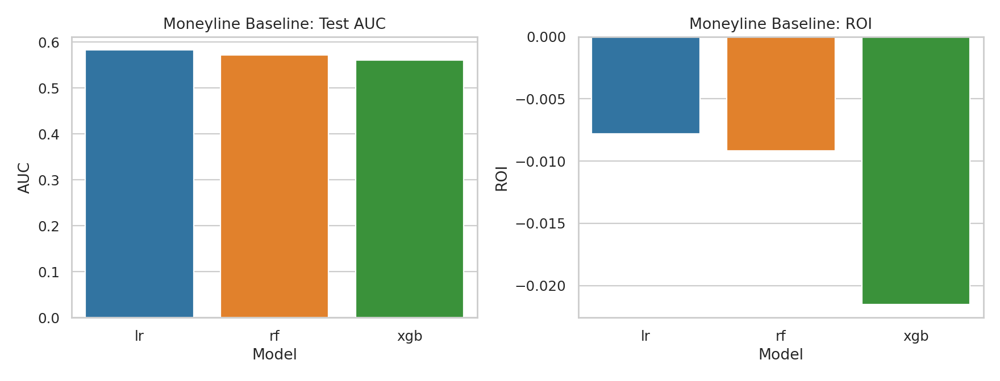
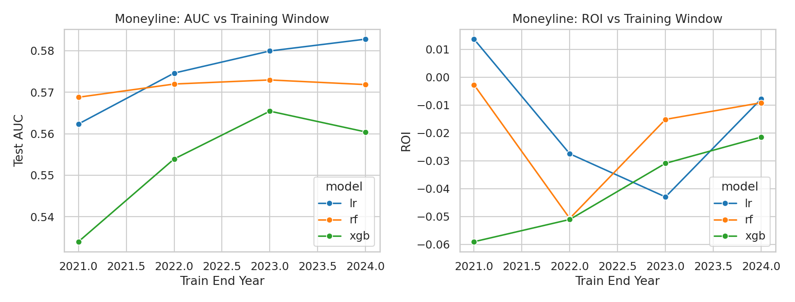
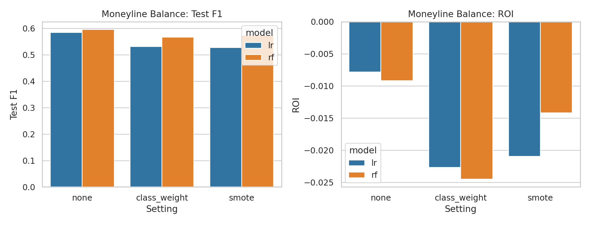
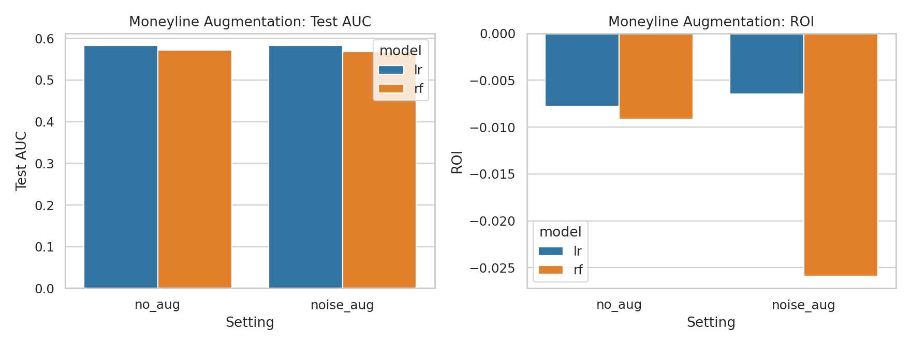
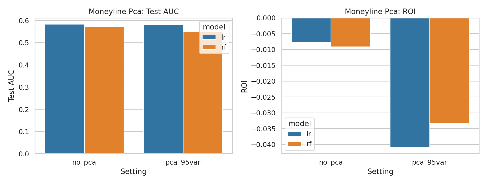
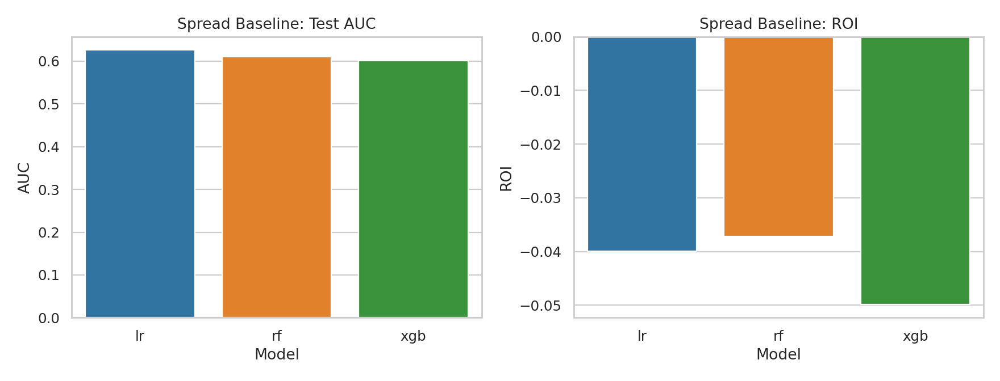
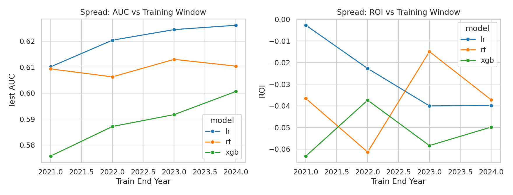
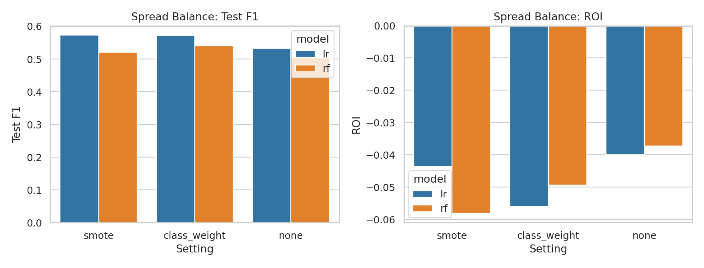
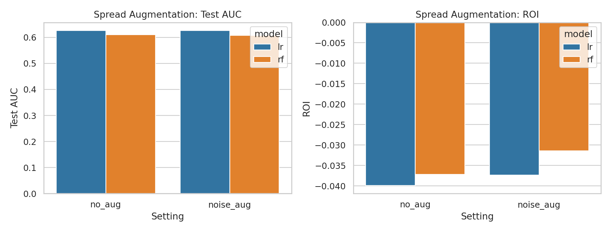
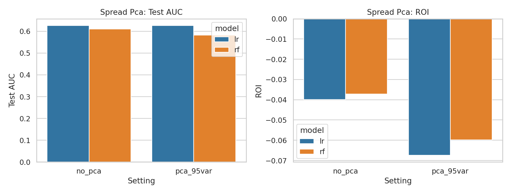

# Artificial Intelligence Project 1
# Research Topic: Profit-Oriented Supervised Learning for MLB Betting
---

## 1. Abstract

This project evaluates whether simple supervised learning models trained on historical MLB betting odds can produce profitable betting strategies when decisions are made using an explicit expected-value (EV) policy. Using SportsbookReview (SBR) odds for the Bet365 sportsbook, I scrape full-game moneyline and point spread markets for 2021–2025, label outcomes directly from the same SBR pages, and train models to predict (i) home win (moneyline) and (ii) home cover (spread). I report both standard classification metrics (AUC, log loss, F1, etc.) and finance-style metrics (profit and ROI per $1 stake) under an EV-threshold policy. Across a 2025 holdout test, logistic regression and random forests achieve modest discrimination, but baseline ROI is negative in both moneyline and spread evaluations, and remains sensitive to training-window and modeling choices. The results reinforce a practical lesson in betting ML: small gains in predictive metrics do not automatically translate into positive ROI once bookmaker margin and selection effects are considered.

---

## 2. Dataset

**Primary source pages (SBR):**
- Moneyline (full game): https://www.sportsbookreview.com/betting-odds/mlb-baseball/money-line/full-game/
- Point spread (full game): https://www.sportsbookreview.com/betting-odds/mlb-baseball/pointspread/full-game/

I use a web crawler `crawl_odds.py` to collect data, for each date:
1) Fetches the SBR page for moneyline odds.
2) Fetches the SBR page for point spread odds.
3) Extracts the Bet365 “current line” and game metadata.
4) Reads final scores from the same page when available.

**Local dataset in this workspace:**
- Yearly labeled files: `2021.csv`, `2022.csv`, `2023.csv`, `2024.csv`, `2025.csv`
- Combined file used for experiments: `all_2021_2025.csv`

The scraper filters to **Bet365** only and converts American odds to **decimal odds**. Scores and outcomes are parsed directly from SBR’s embedded JSON on the odds pages.

**Moneyline label (`result`):**
- `home_win` if `home_score > away_score`
- `away_win` if `away_score > home_score`

**Spread label (`spread_result`):**
Let margin = `home_score + home_spread − away_score`.
- `home_cover` if margin > 0
- `away_cover` if margin < 0
- `push` if margin == 0

### Schema

Each row corresponds to one matchup and sportsbook line.

- `date` (YYYY-MM-DD)
- `game_id` (SBR matchup id)
- `away_team`, `home_team` (SBR shortName codes)
- `away_score`, `home_score`
- `result` (`home_win` or `away_win`)
- `spread_result` (`home_cover`, `away_cover`, or `push`)
- `moneyline_away_decimal`, `moneyline_home_decimal`
- `away_spread`, `home_spread`
- `spread_away_decimal`, `spread_home_decimal`

### Size

From `all_2021_2025.csv`:
- Total rows: **12,107**
- Rows by year: 2021 (2,388), 2022 (2,400), 2023 (2,428), 2024 (2,400), 2025 (2,491)

---

## 3. Research question

This project asks whether supervised learning on historical odds can produce profitable betting decisions.

- **RQ1 (Moneyline):** Can models predict home wins well enough to yield positive profit/ROI on a future holdout season?
- **RQ2 (Spread):** Can models predict home covers and yield positive ROI in the spread market?

The main evaluation uses a **2025 holdout** test season, training on earlier seasons and using time-respecting cross-validation on the training period.

---

## 4. Methods

### Features

**Categorical (one-hot):**
- `away_team`, `home_team`

**Numeric (median-imputed, standardized):**
- `moneyline_home_decimal`, `moneyline_away_decimal` (as “close-use” columns)
- `home_spread`, `away_spread`
- `spread_home_decimal`, `spread_away_decimal`

### Models

Evaluate with these supervised learning models:
- **Logistic Regression (LR)** — Sklearn LogisticRegression, linear baseline for calibrated probability outputs.
- **Random Forest (RF)** — Sklearn RandomForestClassifier, non-linear baseline capable of capturing interactions.
- **XGBoost (XGB)** — included in the “full” run when the library is available.

### Time-series evaluation

Time-based splits:
- Training: years ≤ 2024
- Testing: year = 2025

Cross-validation on the training period uses `TimeSeriesSplit` (rolling splits). Metrics are averaged across folds.

### Betting policy and profit definition

The goal is *profit*, not only classification.

For each test game, the model outputs $p = P(\text{home wins})$ (moneyline) or $p = P(\text{home covers})$ (spread).

Given decimal odds $o_{home}$ and $o_{away}$:

- $EV_{home} = p \cdot o_{home} - 1$
- $EV_{away} = (1-p) \cdot o_{away} - 1$

Policy:
- Bet the side with larger EV **only if** $\max(EV_{home}, EV_{away}) > \tau$.
- Otherwise, do not bet.

Profit for a $1 stake bet$:
- If bet wins: $o - 1$
- If bet loses: $-1$

ROI is computed as:

$$ROI = \frac{\sum_i \text{profit}_i}{\sum_i \text{stake}_i}$$

where stake is $1$ for placed bets and $0$ otherwise.

---

## 5. Experiments and results

This section summarizes the artifacts produced by the automated experiment runner.

### 5.1 Baseline (train ≤ 2024, test = 2025; EV threshold = 0)

**Moneyline baseline**:

| Model | CV AUC | Test AUC | Test F1 | Test LogLoss | ROI | Profit ($1 units) | Bets |
|---|---:|---:|---:|---:|---:|---:|---:|
| lr | 0.595 | 0.583 | 0.585 | 0.679 | -0.78% | -13.59 | 1739 |
| rf | 0.592 | 0.572 | 0.596 | 0.688 | -0.92% | -17.82 | 1941 |
| xgb | 0.573 | 0.560 | 0.590 | 0.699 | -2.15% | -43.00 | 2000 |

Interpretation:
- Predictive skill is modest (AUC slightly above 0.5).
- Baseline profit is negative; the EV-based policy does not overcome market margin in 2025 under the default settings.

See plot:

### 5.2 Training data amount

I vary the training window (e.g., train≤2021, train≤2022, …, train≤2024) with test fixed to 2025.

Headline finding:
- LR’s best ROI in this run occurs at a smaller training window (train≤2021) with **ROI ≈ +1.36%**, but with lower AUC (≈ 0.562). This suggests strong non-stationarity: adding more seasons can improve probability quality without improving profitability.

See plot:

### 5.3 Class balancing (class_weight, SMOTE)

I test imbalance handling:
- None
- `class_weight=balanced`
- SMOTE (on training folds)

Headline finding:
- For LR and RF, balancing *did not improve ROI* relative to the unbalanced baseline.

See plot:

### 5.4 Data augmentation (numeric noise)

I test a simple duplication + small Gaussian noise on numeric columns.

Headline finding:
- LR sees a small ROI improvement (still negative): ROI improves from **-0.78%** to **-0.65%**.
- RF degrades under this augmentation.

See plot:

### 5.5 Dimensionality reduction (PCA)

PCA (95% variance) is applied after preprocessing.

Headline finding:
- PCA hurts ROI substantially in this setup.

See plot:

---

## 6. Spread experiments and results (full run; for moneyline vs spread comparison)

This section mirrors Section 5, but trains/evaluates on the **spread** target (`home_cover`) so results can be compared directly against moneyline.

Spread full-run artifacts are summarized in:
- `reports/experiments_spread/all_results.csv`
- `reports/experiments_spread/summary_by_experiment.csv`

### 6.1 Baseline (train ≤ 2024, test = 2025; EV threshold = 0)

**Spread baseline**:

| Model | CV AUC | Test AUC | Test F1 | Test LogLoss | ROI | Profit ($1 units) | Bets |
|---|---:|---:|---:|---:|---:|---:|---:|
| lr | 0.585 | 0.626 | 0.533 | 0.666 | -3.99% | -66.05 | 1655 |
| rf | 0.582 | 0.610 | 0.504 | 0.673 | -3.72% | -70.54 | 1895 |
| xgb | 0.560 | 0.601 | 0.503 | 0.681 | -4.98% | -100.54 | 2017 |

Interpretation:
- Spread target gives higher AUC than moneyline baseline, but realized ROI is still negative.

See plot:

### 6.2 Training data amount (spread target)

I vary the spread training window (train≤2021, train≤2022, train≤2023, train≤2024), with test fixed to 2025.

Headline finding:
- LR at train≤2021 has the best spread ROI among LR windows (**≈ -0.27%**), while train≤2024 has higher AUC (≈ 0.626) but worse ROI (≈ -3.99%).
- RF is best at train≤2023 by ROI (≈ -1.49%), but remains negative across all windows.
- XGB remains negative for all windows, with best ROI around train≤2022 (≈ -3.74%).

Interpretation:
- As with moneyline, adding more seasons can improve ranking metrics while worsening profit behavior.

See plot:

### 6.3 Class balancing (spread target)

I test spread-target imbalance handling for LR and RF:
- None
- `class_weight=balanced`
- SMOTE (on training folds)

Headline finding:
- For both LR and RF, balancing strategies (`class_weight`, SMOTE) increase F1 but reduce ROI versus no balancing.
- Example (LR): ROI moves from **-3.99%** (none) to **-5.60%** (`class_weight`) and **-4.37%** (SMOTE).
- Example (RF): ROI moves from **-3.72%** (none) to **-4.94%** (`class_weight`) and **-5.81%** (SMOTE).

Interpretation:
- Better class-balance-oriented classification metrics do not necessarily improve betting profitability.

See plot:

### 6.4 Data augmentation (spread target)

I test duplication + small Gaussian numeric noise.

Headline finding:
- LR sees a small improvement in ROI (from **-3.99%** to **-3.73%**) while AUC is nearly unchanged.
- RF also improves ROI under noise augmentation (from **-3.72%** to **-3.14%**) but AUC decreases slightly.

Interpretation:
- Augmentation slightly helps spread ROI in this setup, but not enough to become profitable.

See plot:

### 6.5 Dimensionality reduction (PCA, spread target)

PCA (95% variance) is applied after preprocessing.

Headline finding:
- PCA worsens spread ROI substantially (about **-3.99%** to **-6.74%**), despite similar AUC.

Interpretation:
- For this spread task, dimensionality reduction removes information that appears important for EV-based decisions.

See plot:

---

## 7. Discussion

### 7.1 Why can AUC/F1 improve while ROI stays negative?

Several reasons are consistent with these results:
- **Selection effects**: an EV-based policy selectively bets, changing the distribution of outcomes relative to overall classification.
- **Calibration**: even decent ranking (AUC) can lead to negative EV if probabilities are miscalibrated.
- **Non-stationarity**: relationships between teams/odds/outcomes shift season to season.

### 7.2 What did I learn?

- Odds-only features can produce modest predictive skill but do not reliably yield positive ROI in the tested configuration.
- Spread vs moneyline comparison shows that better discrimination (higher AUC) does not automatically improve profitability.
- ROI remains high-variance and sensitive to training window and modeling choices.
- **DON't gamble since most of the time will not get profit**

### 7.3 Practical implications

If the goal is actual profitable betting, likely next steps are:
- richer features (starting pitchers, rest days, injuries, line movement)
- better probability calibration

### 7.4 Conclusion

- **Answer to RQ1 (moneyline):** With odds-only features and the tested EV policy, the evaluated models achieve modest predictive skill in 2025 but do **not** demonstrate stable positive ROI.
- **Answer to RQ2 (spread):** Spread prediction shows higher AUC, but ROI remains negative; ranking performance alone is insufficient for profitability.

Overall, this study suggests that extracting a reliable betting edge from closing odds alone is difficult, and profitability claims should be backed by repeated out-of-sample and cross-market evidence.

## 8. References

- Breiman, L. (2001). Random Forests. *Machine Learning*, 45, 5–32.
- Brier, G. W. (1950). Verification of forecasts expressed in terms of probability. *Monthly Weather Review*, 78(1), 1–3.
- scikit-learn documentation (models, metrics, and `TimeSeriesSplit`): https://scikit-learn.org/